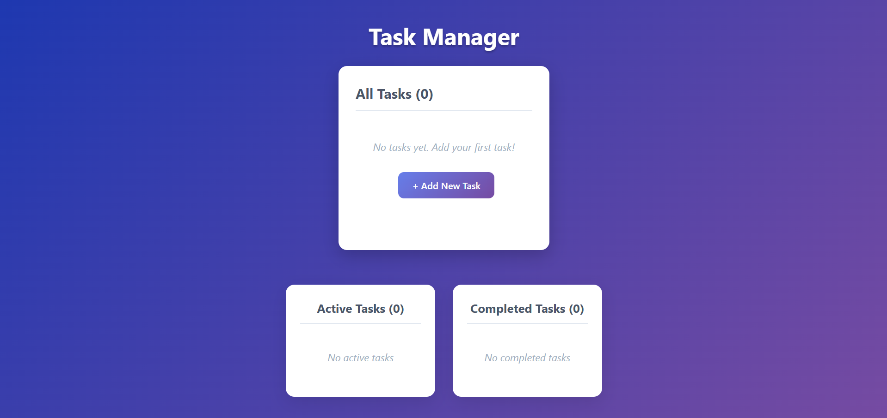

# Task Manager App

A simple React-based task manager to help you organize and track your daily tasks. Tasks are stored in **localStorage**, so your data persists even after refreshing the page.

## Features

- Add new tasks with a category name
- Edit existing tasks
- Mark tasks as completed
- Delete individual tasks
- Filter tasks into **Active** and **Completed** sections
- Shows task creation timestamps
- Clear all tasks with a single button
- Data persists using localStorage

## Demo

## Installation

1. Clone the repository: `git clone https://github.com/your-username/taskManager.git`
2. Install dependencies: `npm install` or `npm i`
3. Start the server: `npm run dev` or `npm start`
4. Open `http://localhost:5173`
